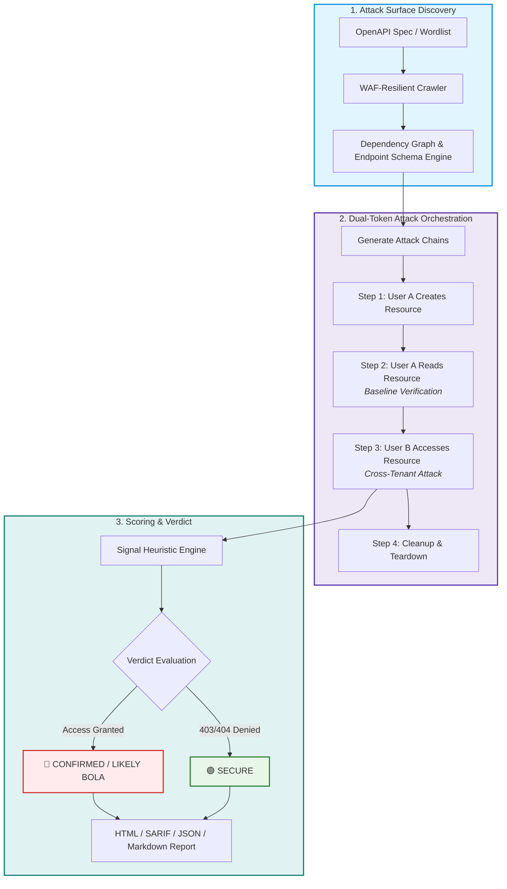

# APIGhost


APIGhost is a stateful, dual-token API security scanner designed to hunt for complex authorization flaws like BOLA/IDOR, BFLA, and Mass Assignment. 

Traditional DAST tools and fuzzers struggle with APIs because they test endpoints in isolation. They fire off GET requests, get a 404 or 403, and move on. APIGhost works differently. It builds a dependency graph of the API, executes requests in stateful chains (Create -> Read -> Delete), and uses two distinct user sessions to mathematically prove when one user can access another user's data.

If the target API doesn't publish an OpenAPI spec, APIGhost ships with a built-in, WAF-resilient crawler to discover endpoints and infer schemas on the fly.

## Features

- **Stateful BOLA Testing**: Automatically strings together `POST` and `GET` requests to test IDORs on real, newly created resources rather than brute-forcing dead IDs.
- **Spec-less Auto-Discovery**: Point APIGhost at a base URL and a wordlist. It will map the attack surface and generate a usable schema automatically.
- **WAF Evasion & Bypasses**: Ships with concurrency limits, jitter, and automated injection of proxy headers (e.g., `X-Forwarded-For`) to bypass weak ACLs.
- **Advanced Logic Flaws**: Automatically tests for HTTP Parameter Pollution (HPP) and array-wrapping bypasses when standard tests fail.
- **Intelligent Payloads**: Uses pre-fetching and heuristics to inject valid UUIDs, emails, and data types instead of sending malformed junk that just gets blocked by input validation.
- **OWASP API Top 10 Coverage**: Tests for BOLA, BFLA, Mass Assignment, Excessive Data Exposure, Rate Limiting, and Injection (SSTI/SQLi).

## Architecture & Attack Workflow



## Installation

APIGhost requires Python 3.12+ and can be installed natively.

```bash
# Recommended: Install via pipx to avoid environment conflicts
pipx install git+https://github.com/Arul-AGC/APIGhost.git

# Or standard pip installation
pip install git+https://github.com/Arul-AGC/APIGhost.git
```

## Quick Start

### 1. The Crawler (If you don't have an OpenAPI spec)
Run the crawler against a target to map the API and infer the JSON schemas.

```bash
apighost crawl https://api.example.com wordlists/common_endpoints.txt \
  --output spec.json \
  --token "eyJhbG..." \
  --concurrent 20 \
  --delay 0.5
```

### 2. The Scanner
Run a full stateful scan against the API. You must provide two tokens (User A and User B) to test for BOLA.

```bash
apighost scan https://api.example.com \
  --spec spec.json \
  --token-a "UserA_Token" \
  --token-b "UserB_Token" \
  --auth-mode bearer \
  --aggressive
```

## Documentation

For deep dives into the engine mechanics and vulnerability detection logic, see the docs:
- [Architecture & Engine Details](docs/ARCHITECTURE.md)
- [Vulnerability Coverage & Bypasses](docs/VULNERABILITIES.md)
- [Contributing Guidelines](CONTRIBUTING.md)

## Disclaimer

**APIGhost is created for educational purposes and authorized security auditing only.** 
The authors and contributors are not responsible for any misuse, damage, or illegal activities caused by this tool. Always obtain explicit, written permission from the target system's owner before scanning or testing.

## License

MIT License — see [LICENSE](LICENSE) for details.
